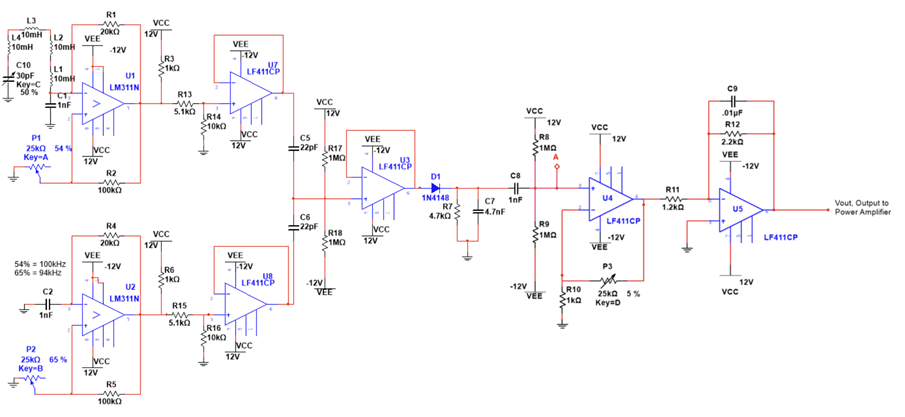

# ECE291 Electrical Engineering Sophomore Projects

## Course Overview  
This repository contains coursework and projects from **ECE-291: Sophomore Electrical Engineering Projects** at [The Cooper Union](http://www.cooper.edu). The course focuses on **analyzing and constructing complex electrical systems** while reinforcing key engineering principles.  

### **Course Description**  
- **Electrical Engineering Principles** – Frequency response, noise, feedback, loading, and interfacing.  
- **Analog Circuit Design** – Construction and testing of amplifiers, oscillators, RF/opto-electronic circuits, and power circuits.  
- **Signal Processing** – Understanding heterodyning, envelope detection, and frequency modulation.  
- **Systems Engineering** – Development of a testbench, performance analysis, and proper documentation.  
- **Lab Instrumentation** – Hands-on experience using oscilloscopes, multimeters, function generators, and other tools.  

---

## **Project Overview: Theremin Circuit**  
The primary project for this course involved designing and constructing a **Theremin**, an electronic musical instrument controlled without physical contact. The Theremin operates based on **frequency modulation**, where hand proximity to an antenna alters capacitance, affecting oscillator frequency and producing an audible tone.

### **Key Components**  
- **Oscillators and Filters** – Generate and refine the signal for audio output.  
- **Envelope Detectors and Amplifiers** – Extract and amplify the amplitude envelope of the signal.  
- **Voltage Dividers and DC Blocking Capacitors** – Stabilize the signal and remove noise.  

---

## **Project Files**  
Below are the key project files displaying the Theremin circuit design:

### **Block Diagram**  
This diagram provides a high-level overview of the system structure.  
  

### **Schematic**  
A complete schematic of the Theremin circuit.  
  

### **Circuit Stage Breakdown**  
A breakdown of the different stages of the Theremin circuit.  
  

### **Final Circuit**  
The final implemented version of the Theremin circuit.  
  

---

## **Copyright & Licensing**  
Copyright (C) 2024 Taha Akhlaq <[takhlaq04@gmail.com](mailto:takhlaq04@gmail.com)>  

Distributed under the MIT License. See [`LICENSE`](LICENSE) for details.  

For more information on my projects and other academic work, please visit my [GitHub profile](https://github.com/TahaAkhlaq).  
